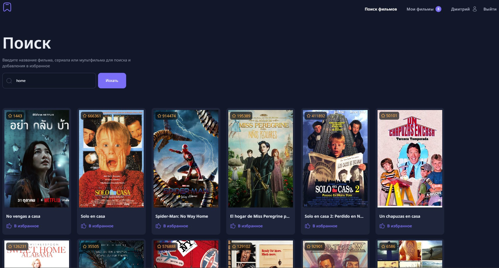
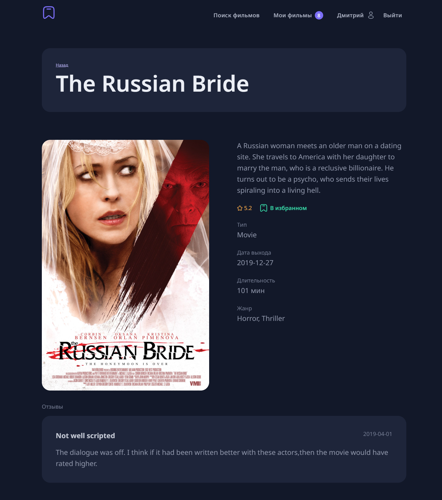
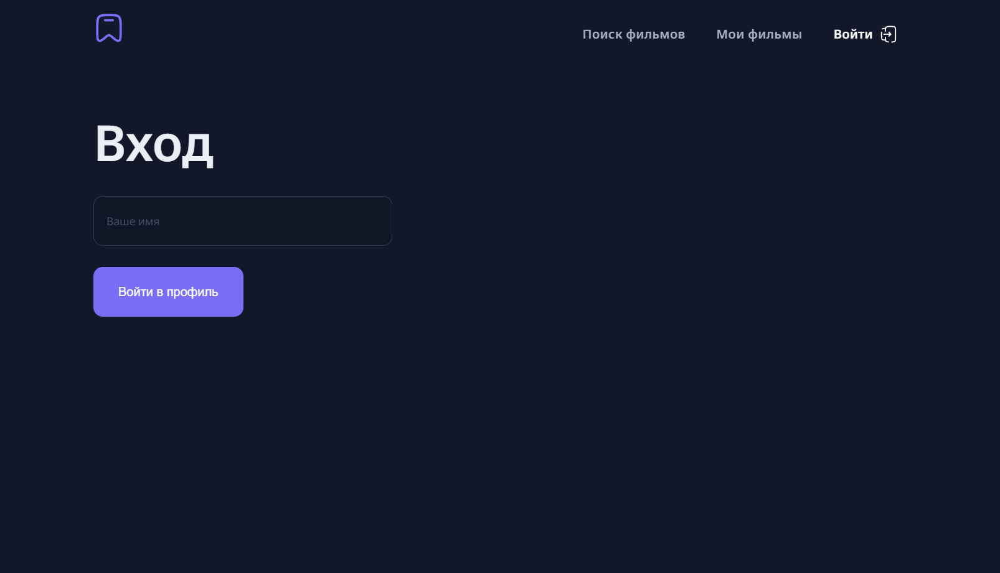
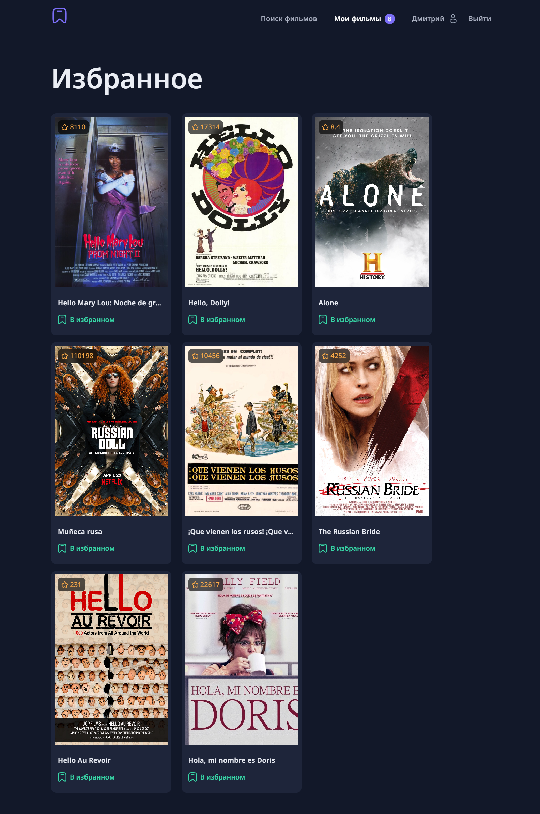

# Movie Theater

**Movie Theater** — это веб-приложение для поиска, просмотра и управления избранными фильмами и сериалами. Приложение построено с использованием **React**, **Vite**, и **TypeScript** для надежной типизации, а также использует **React Router** для маршрутизации и **Redux Toolkit** для управления состоянием.

Приложение использует **localStorage** для хранения списка избранных фильмов и данных пользователей, а для поиска фильмов используется внешний **API**.

## Основные возможности

- **Поиск фильмов** — позволяет пользователям искать фильмы по названию с использованием API для получения данных.
- **Страница фильма** — предоставляет информацию о каждом фильме, включая постер, описание, рейтинг и отзывы.
- **Избранное** — пользователи могут добавлять фильмы в избранное для быстрого доступа к ним в будущем. Избранное сохраняется в **localStorage**, чтобы данные сохранялись при перезагрузке страницы.
- **Страница входа** — интерфейс для авторизации пользователей. Данные пользователей сохраняются в **localStorage**.
- **Маршрутизация** — приложение поддерживает несколько страниц и маршрутов с помощью **React Router**.
- **Управление состоянием** — глобальное состояние, включая избранное и состояние авторизации, управляется с помощью **Redux Toolkit**.

## Скриншоты

### Главная страница

На главной странице отображается поле для поиска и список популярных фильмов. Пользователь может ввести название фильма для поиска.

### Страница фильма

На странице фильма представлена подробная информация о выбранном фильме, включая постер, описание, рейтинг и отзывы пользователей.

### Страница логина

На странице входа пользователи могут авторизоваться в приложении, используя свои учетные данные. Данные пользователей сохраняются в **localStorage** для удобства.

### Избранное

На странице избранного отображаются все фильмы, которые пользователь добавил для быстрого доступа.

## Стек технологий

- **React** — библиотека для создания пользовательского интерфейса.
- **Vite** — инструмент для сборки проекта с поддержкой HMR.
- **Redux Toolkit** — управление глобальным состоянием приложения.
- **React Router** — маршрутизация для работы с несколькими страницами.
- **TypeScript** — статическая типизация для повышения надежности и поддерживаемости кода.
- **localStorage** — для хранения избранных фильмов и данных пользователей.
- **API** — для поиска фильмов и получения данных о них.
- **ESLint** — инструмент для обеспечения качества кода.

## Контакты

- **Email:** vorosdmi@gmail.com
- **Whatsapp (RUS):** [Дмитрий 79823455042](https://wa.me/79823455042)
- **Whatsapp (EN):** [Dmitrii 34663409076](https://wa.me/34663409076)
